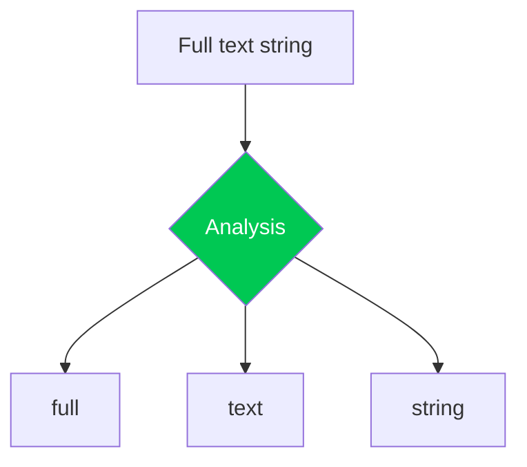

# 📘 Analysis

Terminology: analysis, tokenization, tokens, terms

* Diagrams of tokens that are generated from various analyzers
* Built-in analyzers from lucene.keyword to the others
* Labs: lucene.standard, lucene.english, custom analyzer

https://www.mongodb.com/docs/atlas/atlas-search/analyzers/

## Analysis matters

TODO: make this an exercise to get from one to the other
* “searches” query does not match “Search” with lucene.standard
* “searches” matches “Search” using lucene.english

# multi
Why?
Relevancy example: boost each multi uniquely
Multiple language example: may not know the language of the content and each document could be different - multi across all possible languages, query across them as desired at query-time, let relevancy sort it out
Example of being able to do ‘startsWith’ and ‘endsWith’ using wildcard and ‘reverse’ token filter:
https://search-playground.mongodb.com/tools/code-playground/snapshots/6683c8bc4a45448733549bbc

* Text: the heart and soul of your content
* Strings are analyzed, tokenized into terms
  * Multiple analyzers can be used for a single string field (multi)
* Terms: words, fragments, atomic searchable units
* An inverted index structure organizes terms lexicographically/alphabetically for quick lookup (aka a dictionary)
* Term statistics:
  * Posting list: document identifiers
  * Term frequency (tf): how many occurrences of the term per document
  * Document frequency (df): how many documents contain the term
  * Positions: where in the document does this term occur

lucene.standard (default): tokenizes at word break characters, removes punctuation, and lowercases
lucene.english: standard tokenization plus de-pluralization, stop word removal, and stemming
lucene.keyword: Tokenizes text as a single term; suitable for wildcard or regex matching over entire value
Many language-specific analyzers built-in: (lucene.)arabic, armenian, basque, bengali, brazilian, bulgarian, catalan, chinese, cjk, czech, danish, dutch, english, finnish, french, galician, german, greek, hindi, hungarian, indonesian, irish, italian, japanese, korean, kuromoji, latvian, lithuanian, morfologik, nori, norwegian, persian, polish, portuguese, romanian, russian, smartcn, sorani, spanish, swedish, thai, turkish, ukrainian

`searchAnalyzer` vs. `analyzer` and which one is chosen when

# Using scoreDetails to glimpse analysis in action:

....

## Basic examples

lucene.standard matching case-insensitive: https://search-playground.mongodb.com/tools/code-playground/snapshots/664738af4e0a3f240a5de9d9

### Query operators

`string` mapped fields can be queried with any of these operators:

* `text`: matches any of the query terms; can include synonyms and fuzziness
* `phrase`: matches query terms that occur in proximity
* `regex`: advanced pattern matching
* `wildcard`: matches across missing characters; useful for prefix matching
* `moreLikeThis`: matches documents that overlap important terms of a query document

### Analysis occurs on query values

Except on regex and wildcard operators: partial strings not analyzable
Index-time and search-time analyzers can be different, if needed

Remember: it’s a dictionary

Index it how you’d like to find it; search for it how you indexed it

Leverage analyzers to index text efficiently for searching
Index statistics factor into score computations

## Configuration options

  * `storedSource`
  * `synonyms`

