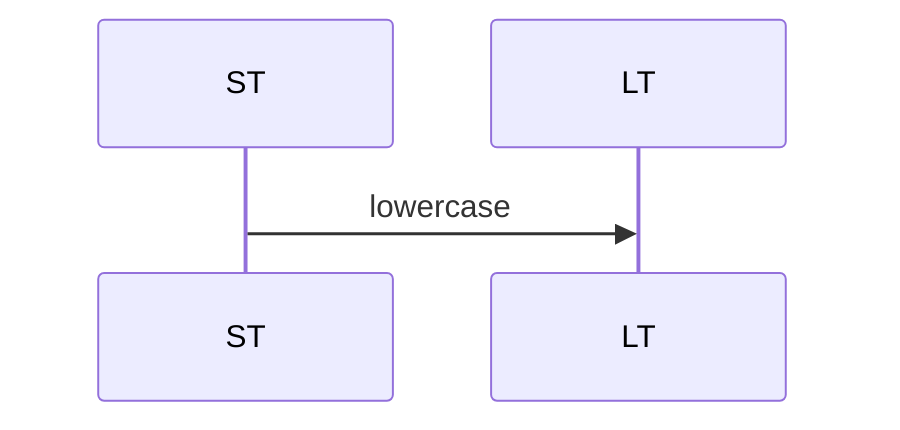
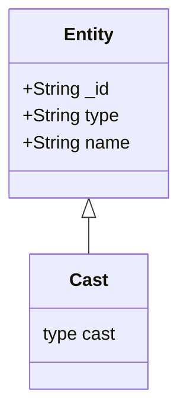

# 🎯 Summary

Congratulations!  

## Search Demo Builder

Do a demonstration of this tool, discussing it's sweet spot

## Search topics not covered here

* moreLikeThis
* Faceting
* Highlighting
* Pagination
* partitioned indexes (new preview feature)

## Advanced Cool Tricks

### Which clause matches?
https://search-playground.corp.mongodb.com/tools/code-playground/snapshots/669e82e12ce7658e786edc03

### Which embedded document matched?
https://search-playground.corp.mongodb.com/tools/code-playground/snapshots/669e850dd49ef6fad98118d6

### knnBeta + regex prefilter
https://search-playground.corp.mongodb.com/tools/code-sandbox/snapshots/6797f2b4e68ae0bae860ea80

### Highlighting
  * https://search-playground.mongodb.com/tools/code-sandbox/snapshots/6785d30eb6487c1cfd0bb817

